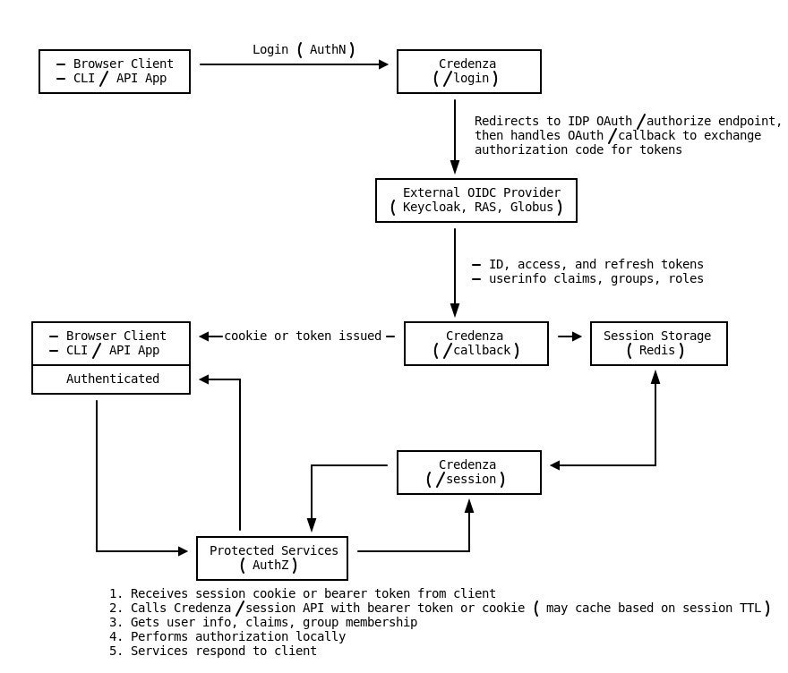

# Credenza

### OIDC Relying Party and Narrow OAuth 2.1 Authorization Server

**Credenza** is a RESTful web service that functions as both an OIDC Relying Party (RP) and a narrow OAuth 2.1
Authorization Server (AS). It handles OAuth2/OIDC login/logout/device flows to upstream OIDC Identity Providers (IdPs)
and caches OIDC userinfo, identity claims, and tokens in a persistent session storage layer. It then issues opaque,
audience-bound access tokens for protected resource servers — validated via RFC 7662 token introspection.

Credenza also supports **machine-to-machine (M2M) authentication** via the OAuth 2.0 `client_credentials` grant.
Clients prove identity via configured adapters (e.g., AWS STS presigned GetCallerIdentity, client secret), and receive
opaque bearer tokens bound to configured scopes and resource audiences.

#### Features:

- Supports multiple OIDC Identity Providers via configuration profiles (Keycloak, Okta, Cognito, Globus, etc.)
- Persistent session storage with lifecycle management and session encryption
- All OAuth2/OIDC flows use the Python `authlib` module with PKCE enabled whenever applicable
- **OAuth 2.1 Authorization Server** capabilities:
  - RFC 8414 Authorization Server Metadata discovery
  - RFC 7662 Token Introspection with per-client resource gating
  - RFC 8693 Token Exchange with default-deny exchange policy
  - RFC 7009 Token Revocation
  - Authorization Code + PKCE flow for registered clients
  - Client Credentials grant for M2M / service authentication
  - RFC 8628 Device Authorization Grant (fully spec-compliant)
- **Client authentication** via extensible adapter interface:
  - `client_secret` (HTTP Basic or form post)
  - `aws_presigned` (AWS STS presigned GetCallerIdentity — no shared secrets)
  - Custom adapters (mTLS, workload identity, etc.) via `@register_adapter`
- Unified client registry with per-client grant type, scope, resource, and lifetime policy
- Opaque bearer tokens backed by server-side sessions (instantly revocable, auditable)
- Secure background token refresh for device sessions
- Audit logging
- Prometheus metrics

### Why Credenza?

Modern applications increasingly delegate authentication to external identity providers using protocols like OIDC,
but often stop short of managing the resulting session lifecycle and token hygiene with equal rigor. This leaves
critical gaps — expired tokens that are still accepted, refresh tokens lingering beyond their intended lifetime, and no
clear view into when or how access was last granted, renewed, or revoked.

**Credenza** fills that void by acting as a lightweight, centralized session broker that maintains consistent access and
refresh token lifecycles across distributed services. It handles token acquisition and refresh delegation, emits structured audit
events, and supports distributed session inspection without exposing sensitive credentials externally.

Credenza extends these guarantees to **service identities** as well: service tokens are **validated by session lookup**
(not self-contained JWTs), enabling **immediate revocation**, consistent renewal semantics, and centralized auditing/rate limiting.

As recent security analyses have highlighted, modernization without coherent identity and session oversight can create more surface area
for compromise — not less. By providing observability, rotation, and revocation for both user and service tokens,
Credenza helps bring your authentication layer closer to the operational standards expected in secure,
federated environments.

#### Further Reading

* [Application identity modernization poses significant risks](https://www.helpnetsecurity.com/2025/05/27/application-identity-modernization-risks/) – Help Net Security
* [Session Management in Microservices](https://www.geeksforgeeks.org/system-design/session-management-in-microservices) – GeeksforGeeks

### Credenza User Authentication Flow

* #### Credenza [User Auth (OIDC)](docs/user_auth_oidc.md) Documentation

### Credenza Client Authentication (M2M) Flow

- **Issue token** — `POST /authn/token`
  - `grant_type=client_credentials`
  - Adapter-specific proof fields (client secret or AWS presigned URL)
  - Returns: `{"access_token": "<opaque>", "token_type": "Bearer", "expires_in": <seconds>}`

- **Revoke token** — `POST /authn/revoke` (RFC 7009)
  - `token=<access_token>` plus client authentication
  - Returns: `200` on all outcomes

- **Introspect token** — `POST /authn/introspect` (RFC 7662)
  - Used by resource servers to validate opaque tokens
  - Returns standard active/inactive response with claims

* #### Credenza [Client Auth (M2M)](docs/client_auth.md) Documentation

### Further Documentation

* #### [Configuration Reference](docs/configuration.md) — `credenza.env`, `oidc_idp_profiles.json`, and `client_registry.json`
* #### [OAuth & OIDC Profile](docs/credenza-oauth-profile.md) — supported RFCs, grant types, and token characteristics
* #### [Security Model](docs/security_model.md) — threat model, trust boundaries, and operational assumptions
* #### [ADR-0001: Narrow OAuth AS Profile](docs/ADR-0001-narrow-oauth-profile.md) — architecture decision record
* #### [ADR-0002: Delegation Consent](docs/ADR-0002-delegation-consent.md) — optional consent UI and delegation transparency
* #### [ADR-0003: mTLS Client Authentication](docs/ADR-0003-mtls-client-auth.md) — RFC 8705 mutual TLS adapter
* #### [ADR-0004: private_key_jwt Client Authentication](docs/ADR-0004-private-key-jwt-client-auth.md) — RFC 7523 asymmetric JWT adapter (blue-sky)

### Project Status

This project is being actively developed and should be considered Alpha quality. It is a functional prototype but is
also subject to change at any point without notice.
