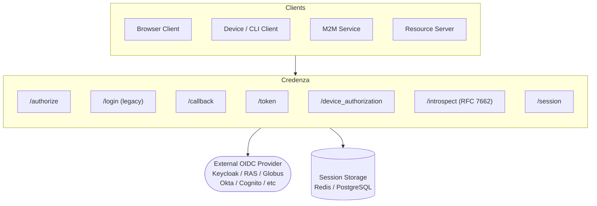
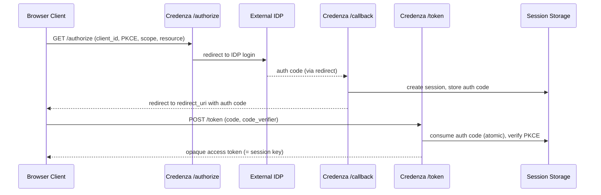
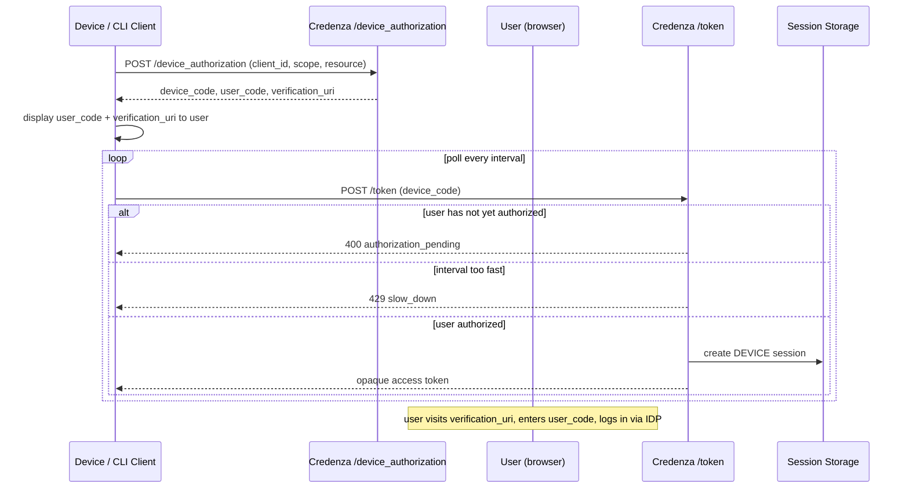
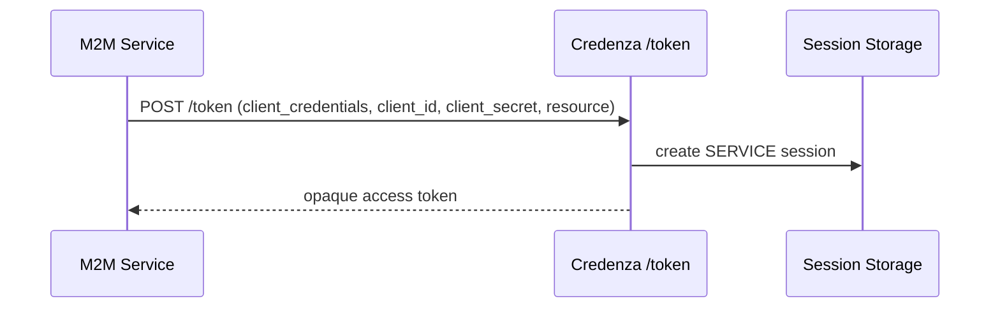
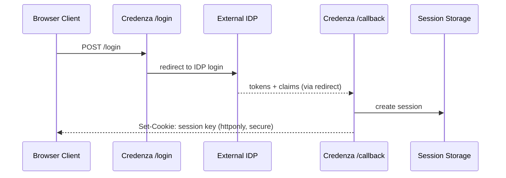
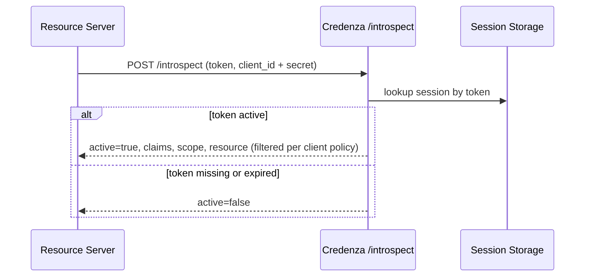
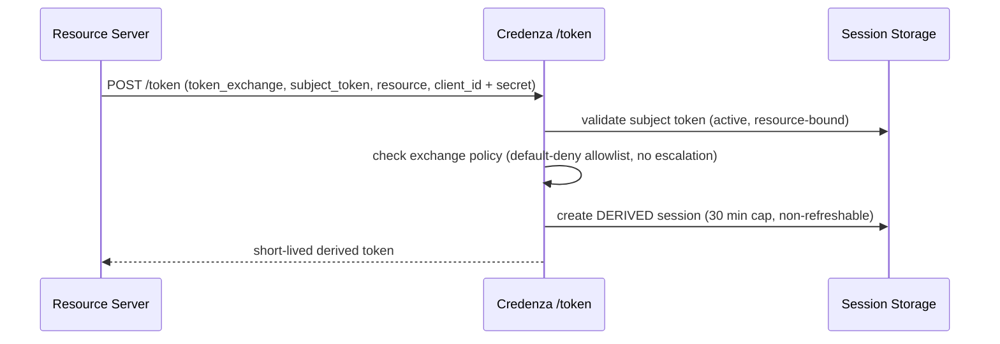
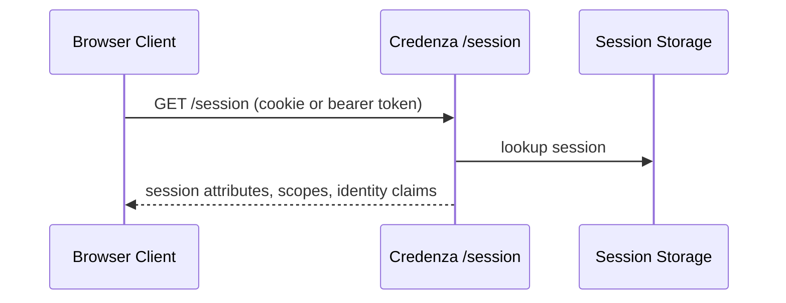

# Credenza Authentication Flows

<!-- --8<-- [start:flow-overview] -->
## Component Overview

<!-- --8<-- [end:flow-overview] -->

---

<!-- --8<-- [start:flow-authcode] -->
## Flow 1: Authorization Code + PKCE

Used by OAuth-registered clients (e.g. MCP). No session cookie is set.

<!-- --8<-- [end:flow-authcode] -->

---

<!-- --8<-- [start:flow-device] -->
## Flow 2: Device Authorization Grant (RFC 8628)

Used by CLI tools and headless clients.

<!-- --8<-- [end:flow-device] -->

---

<!-- --8<-- [start:flow-m2m] -->
## Flow 3: Client Credentials (M2M)

Used by backend services authenticating directly with a client secret.

<!-- --8<-- [end:flow-m2m] -->

---

<!-- --8<-- [start:flow-legacy] -->
## Flow 4: Legacy Browser Login

Pre-OAuth flow; still supported. Sets a session cookie instead of issuing an OAuth token.

<!-- --8<-- [end:flow-legacy] -->

---

<!-- --8<-- [start:flow-introspect] -->
## Flow 5: Resource Server -- Token Introspection (RFC 7662)

Resource servers call this to validate an opaque token and retrieve claims.

<!-- --8<-- [end:flow-introspect] -->

---

<!-- --8<-- [start:flow-exchange] -->
## Flow 6: Resource Server -- Token Exchange (RFC 8693)

A resource server exchanges a user token for a short-lived derived token scoped to a downstream service.

<!-- --8<-- [end:flow-exchange] -->

---

<!-- --8<-- [start:flow-session] -->
## Flow 7: Session Inspection

<!-- --8<-- [end:flow-session] -->